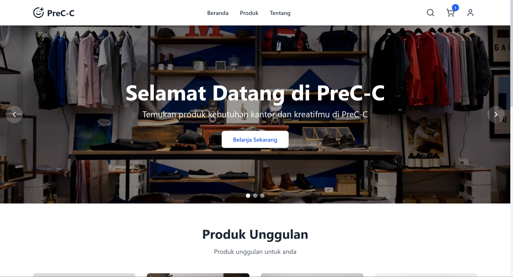
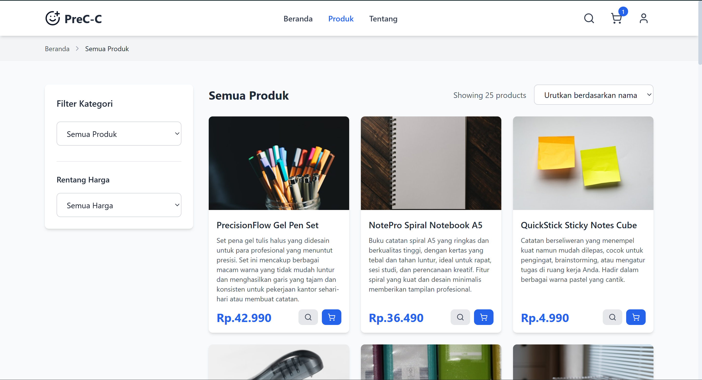
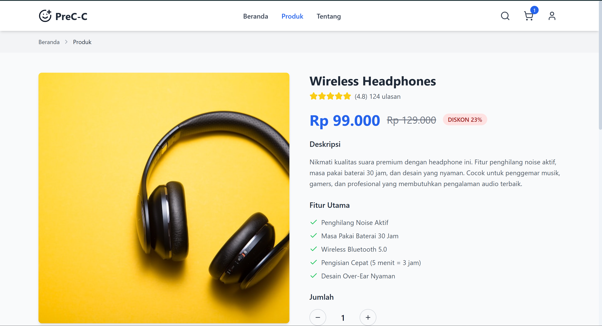
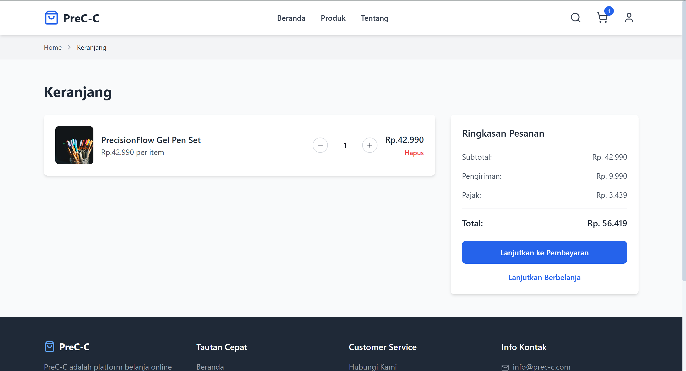
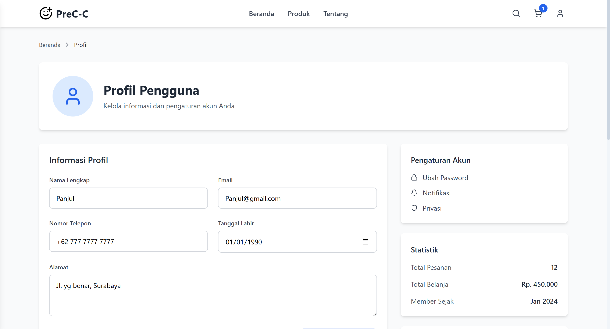
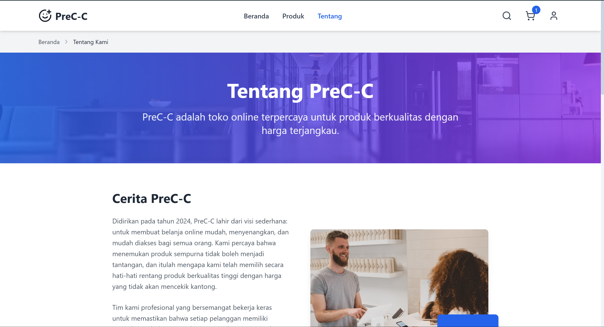

# 🛒 PreC-C - E-Commerce Website

[](https://developer.mozilla.org/en-US/docs/Web/HTML)
[](https://developer.mozilla.org/en-US/docs/Web/CSS)
[](https://developer.mozilla.org/en-US/docs/Web/JavaScript)
[](https://tailwindcss.com/)

Tampilan web e-commerce modern dan responsif untuk penjualan alat tulis kantor dan produk konten kreatif. Dibangun dengan HTML5, CSS, JavaScript, dan Tailwind CSS. Dengan tampilan penelusuran produk, manajemen keranjang, dan profil pengguna.


## 📸 Screenshot

### 🏠 Beranda

*Landing page dengan hero, produk unggulan, dan navigasi*

### 🛍️ Produk

*Katalog produk dengan fungsi filter berdasarkan kategori dan harga*

### 🔍 Detail Produk

*Detail tentang informasi mendalam sebuah produk*

### 🛒 Keranjang

*Keranjang belanja dengan manajemen barang dan proses pembayaran*

### 👤 Profil

*Manajemen profil pengguna dan pengaturan akun*

### ℹ️ Tentang

*Informasi perusahaan dan info kontak*

## 🎥 Demo 

[](https://youtu.be/WQHtveGQ92U?si=WpFkshDKUdzjYuXj)

### Styling
- **Custom CSS**: `assets/css/style.css`
- **Tailwind**: Kelas pada file HTML 

### JavaScript
- **Cart Logic**: `assets/js/cart.js`
- **UI Interactions**: `assets/js/main.js`

## Yang digunakan

- **CSS** - Untuk tampilan responsif, animasi, dan visibilitas.
- **Javascript** - Untuk menampilkan konten dinamis, logika sederhana, dan keranja.
- **Tailwind CSS** - Untuk tampilan CSS yang rapi dan responsif
- **Lucide Icons** - Untuk ikon 
- **Unsplash** - Untuk gambar produk 

## 📁 Project Structure

```
PreC-C_UTS_PBO/
├── index.html              
├── products.html           
├── product.html            
├── cart.html               
├── profile.html            
├── about.html              
├── data.json               
├── README.md               
├── screenshots/            
│   ├── home-page.png
│   ├── products-page.png
│   ├── product-detail-page.png
│   ├── cart-page.png
│   ├── profile-page.png
│   └── about-page.png
└── assets/
    ├── css/
    │   └── style.css       
    └── js/
        ├── main.js         
        ├── cart.js         
        └── products.js     
```